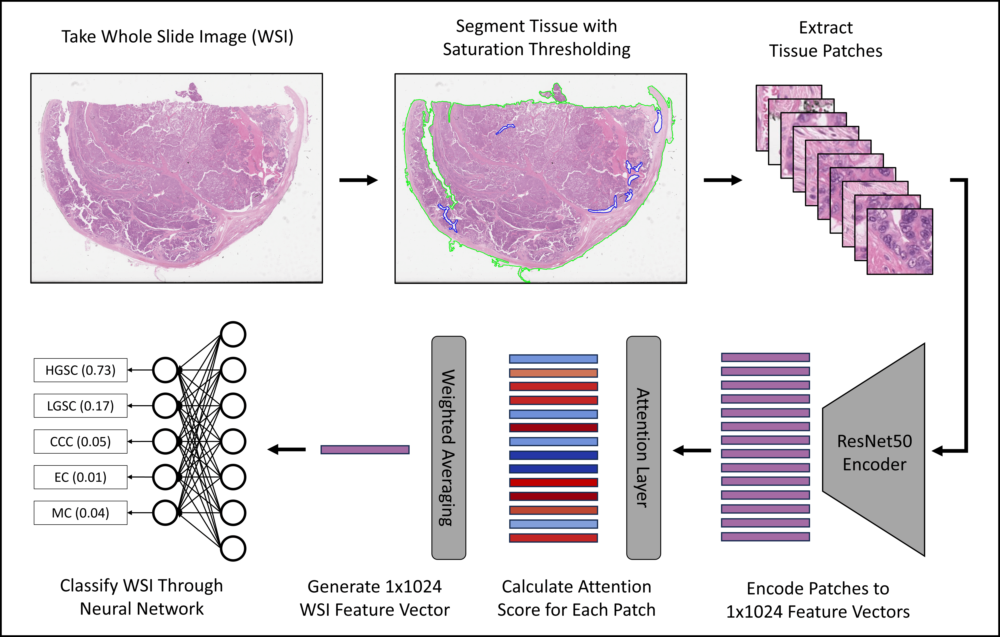
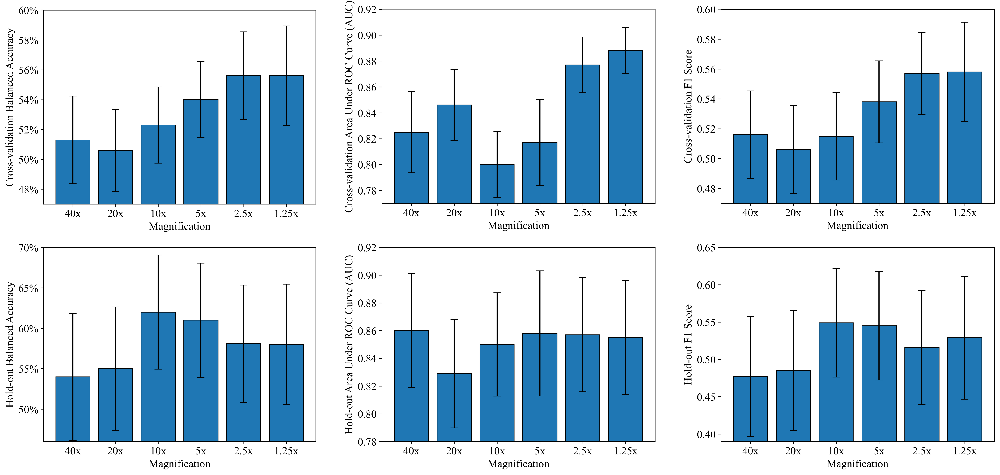

## Reducing Histopathology Slide Magnification Improves the Accuracy and Speed of Ovarian Cancer Subtyping


*An extensive analysis of ovarian cancer WSI magnifications in attention-based multiple instance learning ([ABMIL](https://proceedings.mlr.press/v80/ilse18a.html?ref=https://githubhelp.com))* 

[Preprint](https://arxiv.org/abs/2311.13956)



This repo was created as part of a submission to [ISBI 2024](https://biomedicalimaging.org/2024/).


## Hyperparameters
Final Hyperparamters Determined by Hyperparameter Tuning: 
| Magnif. | Learning Rate | Weight Decay | First Moment Decay | Second Moment Decay | Stability Parameter | Attention Layer Size | Dropout | Max Patches |
| :-------: | :-------------: | :------------: |:------------------:|:-------------------: | :-------------------: | :--------------------: | :-------: | :-----------: |
| 40x     | 1e-3          | 1e-4         |        0.95        | 0.99                | 1e-10               | 512                  | 0.6     | 50000       |
| 20x     | 5e-4          | 1e-4         |        0.99        | 0.99                | 1e-8                | 256                  | 0.7     | 10000       |
| 10x     | 5e-4          | 1e-4         |        0.8         | 0.99                | 1e-4                | 256                  | 0.6     | 1000        |
| 5x      | 5e-4          | 1e-6         |        0.95        | 0.999               | 1e-14               | 128                  | 0.6     | 400         |
| 2.5x    | 1e-3          | 1e-5         |        0.9         | 0.9999              | 1e-4                | 256                  | 0.7     | 40          |
| 1.25x   | 5e-4          | 1e-5         |        0.9         | 0.999               | 1e-14               | 256                  |    0.5  | 7           |

&nbsp;

Hyperparameters were tuned in 13 stages in which 1-3 individual hyperparameters were altered and the rest were frozen. All specific configurations can be accessed in the folder tuning_configs. The maximum number of epochs was set to 30 for the first 3 stages, 100 for stages 4-9, 150 for stages 10-13.

<details>
<summary>
Hyperparameter Tuning Stages
</summary>

- Stage 1: Learning Rate, Max Patches
- Stage 2: First Moment Decay, Second Moment Decay
- Stage 3: Weight Decay, Dropout
- Stage 4: Learning Rate, Dropout, Max Patches
- Stage 5: Attention Layer Size
- Stage 6: Learning Rate, Dropout, Max Patches
- Stage 7: Stability Parameter
- Stage 8: Learning Rate
- Stage 9: Dropout
- Stage 10: Learning Rate, Dropout, Max Patches
- Stage 11: Weight Decay
- Stage 12: Max Patches
- Stage 13: First Moment Decay, Second Moment Decay

</details>


## Results

Barplots showing the results from cross-validation and hold-out experiments, with error bars indicating 95% confidence intervals:


Cross-validation Summary (mean ± s.d. from 10,000 iterations of bootstrapping):
| Magnif. | Balanced Accuracy | Area Under ROC Curve (AUC) |  F1 Score |
| :----------: | :----------: | :----------: | :----------: |
| 40x     | 51.3% ± 1.5%   | 0.825 ± 0.016     | 0.516 ± 0.015     |
| 20x     | 50.6% ± 1.4%   | 0.846 ± 0.014    | 0.506 ± 0.015    |
| 10x     | 52.3% ± 1.3%   | 0.800 ± 0.013    | 0.515 ± 0.015    |
| 5x      | 54.0% ± 1.3%   | 0.817 ± 0.017    | 0.538 ± 0.014    |
| 2.5x    | **55.6% ± 1.5%**   | 0.877 ± 0.011    | 0.557 ± 0.014     |
| 1.25x   | **55.6% ± 1.7%**   | **0.888 ± 0.009**    | **0.558 ± 0.017**   |


<details>
<summary>
Cross-validation Results By Class
</summary>

F1 Score by Class (not bootstrapped): 
| Magnif. | HGSC | LGSC |  CCC | EC | MC |
| :----------: | :----------: | :----------: | :----------: | :----------: | :----------: |
| 40x | 0.844  | 0.000  | 0.667  | 0.668  | 0.407  |
| 20x | 0.823  | 0.000  | 0.645  | 0.668  | 0.400  |
| 10x | 0.846 | 0.000  | 0.712  | 0.669  | 0.351  |
| 5x  | 0.853  | 0.000  | 0.764  | 0.651  | 0.423  |
| 2.5x| 0.852 | 0.000  | 0.738  | 0.682  | 0.518  |
|1.25x| 0.829  | 0.053  | 0.722  | 0.674  | 0.519  |

</details>

<details>
  
<summary>
Cross-validation Confusion Matrices
</summary>
  
<details>
<summary>
40x Cross-validation
</summary>

|  | HGSC | LGSC |  CCC | EC | MC |
| :----------: | :----------: | :----------: | :----------: | :----------: | :----------: |
| HGSC | **429** | 0 | 19 | 25 | 11 |
| LGSC | 17 | **0** | 3 | 1 | 1 |
| CCC | 39 | 0 | **94** | 9 | 14 |
| EC | 38 | 1 | 1 | **139** | 24 |
| MC | 10 | 0 | 9 | 39 | **37** |

class 0 precision: 0.80488 recall: 0.88636 f1: 0.84366

class 1 precision: 0.00000 recall: 0.00000 f1: 0.00000

class 2 precision: 0.74603 recall: 0.60256 f1: 0.66667

class 3 precision: 0.65258 recall: 0.68473 f1: 0.66827

class 4 precision: 0.42529 recall: 0.38947 f1: 0.40659


</details>
<details>
<summary>
20x Cross-validation
</summary>

20x full results breakdown here

</details>
<details>
<summary>
10x Cross-validation
</summary>

10x full results breakdown here

</details>
<details>
<summary>
5x Cross-validation
</summary>

5x full results breakdown here

</details>
<details>
<summary>
2.5x Cross-validation
</summary>

2.5x full results breakdown here

</details>
<details>
<summary>
1.25x Cross-validation
</summary>

1.25x full results breakdown here

</details>
</details>

Hold-out Validation Summary (mean ± s.d. from 10,000 iterations of bootstrapping):
| Magnif. | Balanced Accuracy | Area Under ROC Curve (AUC) |  F1 Score |
| :----------: | :----------: | :----------: | :----------: |
| 40x     | 54.0% ± 4.0%   | **0.860 ± 0.021**     | 0.477 ± 0.041     |
| 20x     | 55.0% ± 3.9%   | 0.829 ± 0.020     | 0.485 ± 0.041     |
| 10x     | **62.0% ± 3.6%**   | 0.850 ± 0.019     | **0.549 ± 0.037**     |
| 5x      | 61.0% ± 3.6%   | 0.858 ± 0.023     | 0.545 ±  0.037    |
| 2.5x    | 58.1% ± 3.7%   | 0.857 ± 0.021     | 0.516 ± 0.039     |
| 1.25x   | 58.0% ± 3.8%   | 0.855 ± 0.021     | 0.529 ± 0.042     |
<details>
<summary>
Detailed Hold-out Validation Results By Magnification (Not Yet Uploaded)
</summary>
  
<details>
<summary>
40x Hold-out Validation Results
</summary>

40x full results breakdown here

</details>
<details>
<summary>
20x Hold-out Validation Results
</summary>

20x full results breakdown here

</details>
<details>
<summary>
10x Hold-out Validation Results
</summary>

10x full results breakdown here

</details>
<details>
<summary>
5x Hold-out Validation Results
</summary>

5x full results breakdown here

</details>
<details>
<summary>
2.5x Hold-out Validation Results
</summary>

2.5x full results breakdown here

</details>
<details>
<summary>
1.25x Hold-out Validation Results
</summary>

1.25x full results breakdown here

</details>
</details>

## Code Examples
The following code includes examples from every stage of pre-processing, hyperparameter tuning, and model validation at multiple magnifications.  

<details>
<summary>
Tissue patch extraction
</summary>
We segmented tissue using saturation thresholding and extracted non-overlapping tissue regions which corresponded to 256x256 pixel patches at 40x (e.g. 512x512 for 20x, 1024x1024 for 10x). At this stage all images are still at 40x magnification, and only the patch size is changing:
  
``` shell
## 40x 256x256 patches for use in 40x experiments
python create_patches_fp.py --source "/mnt/data/Katie_WSI/edrive" --save_dir "/mnt/results/patches/ovarian_leeds_mag40x_patch256_DGX_fp" --patch_size 256 --step_size 256 --seg --patch --stitch 	
## 40x 8192x8192 patches for use in 1.25x experiments
python create_patches_fp.py --source "/mnt/data/Katie_WSI/edrive" --save_dir "/mnt/results/patches/ovarian_leeds_mag40x_patch8192_DGX_fp" --patch_size 8192 --step_size 8192 --seg --patch --stitch 	
``` 
</details>

<details>
<summary>
Feature extraction
</summary>
We then downsampled the patches to the experimental magnification and extracted [1,1024] features from each 256x256 patch using a ResNet50 encoder pretrained on ImageNet:
  
``` shell
## 40x (no downsampling needed)
python extract_features_fp.py --hardware DGX --model_type 'resnet50' --data_h5_dir "/mnt/results/patches/ovarian_leeds_mag40x_patch256_DGX_fp" --data_slide_dir "/mnt/data/Katie_WSI/edrive" --csv_path "dataset_csv/set_edrivepatches_ESGO_train_staging.csv" --feat_dir "/mnt/results/features/ovarian_leeds_resnet50_40x_features_DGX" --batch_size 32 --slide_ext .svs 
## 1.25x (32x downsampling)
python extract_features_fp.py --hardware DGX --custom_downsample 32 --model_type 'resnet50' --data_h5_dir "/mnt/results/patches/ovarian_leeds_mag40x_patch8192_DGX_fp" --data_slide_dir "/mnt/data/Katie_WSI/edrive" --csv_path "dataset_csv/set_edrivepatches_ESGO_train_staging.csv" --feat_dir "/mnt/results/features/ovarian_leeds_resnet50_1point25x_features_DGX" --batch_size 32 --slide_ext .svs 
```
</details>

<details>
<summary>
Hyperparameter tuning
</summary>

Models were tuned using configurations in the folder "tuning_configs", with a separate call used for each of the five cross-validation folds to allow for parallelisation:

``` shell
## 40x tuning first stage first fold
python main.py --tuning --hardware DGX --tuning_output_file /mnt/results/tuning_results/staging_only_resnet50_40x_firsttuning_bce_fold0.csv --min_epochs 0 --max_epochs 30 --early_stopping --num_tuning_experiments 1 --split_dir "esgo_staging_5fold_100" --k 1 --results_dir /mnt/results --exp_code staging_only_resnet50_40x_firsttuning_30epochs_bce_fold0 --subtyping --weighted_sample --bag_loss balanced_ce --no_inst_cluster --task ovarian_5class  --model_type clam_sb --subtyping --csv_path 'dataset_csv/ESGO_train_all.csv' --data_root_dir "/mnt/results/features" --features_folder "ovarian_leeds_resnet50_40x_features_DGX" --tuning_config_file tuning_configs/esgo_staging_resnet50_40x_config1.txt
## 1.25x tuning first stage first fold
python main.py --tuning --hardware DGX --tuning_output_file /mnt/results/tuning_results/staging_only_resnet50_1point25x_firsttuning_bce_fold0.csv --min_epochs 0 --max_epochs 30 --early_stopping --num_tuning_experiments 1 --split_dir "esgo_staging_5fold_100" --k 1 --results_dir /mnt/results --exp_code staging_only_resnet50_1point25x_firsttuning_30epochs_bce_fold0 --subtyping --weighted_sample --bag_loss balanced_ce --no_inst_cluster --task ovarian_5class  --model_type clam_sb --subtyping --csv_path 'dataset_csv/ESGO_train_all.csv' --data_root_dir "/mnt/results/features" --features_folder "ovarian_leeds_resnet50_1point25x_features_DGX" --tuning_config_file tuning_configs/esgo_staging_resnet50_1point25x_config1.txt
```

After running all folds for a given magnification and tuning stage, the validation set balanced cross-entropy loss values were summarised into a csv for analysis:

``` shell
## 40x
python combine_results.py --file_base_name "/mnt/results/tuning_results/staging_only_resnet50_40x_firsttuning_bce"
## 1.25x
python combine_results.py --file_base_name "/mnt/results/tuning_results/staging_only_resnet50_1point25x_firsttuning_bce"
```

</details>


<details>
<summary>
Model training
</summary>
The best model for each magnification from hyperparameter tuning was trained:
  
``` shell
## 40x
python main.py --hardware DGX --min_epochs 0 --max_epochs 150 --early_stopping --split_dir "esgo_staging_5fold_100" --k 5 --results_dir /mnt/results --exp_code staging_only_resnet50_40x_bce_bestfromtuning_50patience --reg 0.0001 --drop_out 0.6 --lr 0.001 --max_patches_per_slide 50000 --model_size small --beta1 0.99 --beta2 0.99 --eps 1e-10 --subtyping --weighted_sample --bag_loss balanced_ce --no_inst_cluster --task ovarian_5class  --model_type clam_sb --subtyping --csv_path 'dataset_csv/ESGO_train_all.csv' --data_root_dir "/mnt/results/features" --features_folder "ovarian_leeds_resnet50_40x_features_DGX"
## 1.25x
python main.py --hardware DGX --min_epochs 0 --max_epochs 150 --early_stopping --split_dir "esgo_staging_5fold_100" --k 5 --results_dir /mnt/results --exp_code staging_only_resnet50_1point25x_bce_bestfromtuning_50patience --reg 0.00001 --drop_out 0.5 --lr 0.0005 --max_patches_per_slide 7 --model_size tiny --beta1 0.9 --beta2 0.999 --eps 1e-14 --subtyping --weighted_sample --bag_loss balanced_ce --no_inst_cluster --task ovarian_5class  --model_type clam_sb --subtyping --csv_path 'dataset_csv/ESGO_train_all.csv' --data_root_dir "/mnt/results/features" --features_folder "ovarian_leeds_resnet50_1point25x_features_DGX"
```
</details>

<details>
<summary>
Model evaluation
</summary>
The models were evaluated on the test sets of the five-fold cross validation with 10,000 iterations of bootstrapping:
  
``` shell
## 40x
python eval.py --drop_out 0.6 --model_size small --models_exp_code staging_only_resnet50_40x_bce_bestfromtuning_50patience_s1 --save_exp_code staging_only_resnet50_40x_bce_bestfromtuning_50patience_bootstrapping --task ovarian_5class --model_type clam_sb --results_dir /mnt/results --data_root_dir "/mnt/results/features" --k 5 --features_folder "ovarian_leeds_resnet50_40x_features_DGX" --csv_path 'dataset_csv/ESGO_train_all.csv' 
python bootstrapping.py  --num_classes 5 --model_names staging_only_resnet50_40x_bce_bestfromtuning_50patience_bootstrapping --bootstraps 10000 --run_repeats 1 --folds 5
## 1.25x
python eval.py --drop_out 0.5 --model_size tiny --models_exp_code staging_only_resnet50_1point25x_bce_bestfromtuning_50patience_s1 --save_exp_code staging_only_resnet50_1point25x_bce_bestfromtuning_50patience_bootstrapping --task ovarian_5class --model_type clam_sb --results_dir /mnt/results --data_root_dir "/mnt/results/features" --k 5 --features_folder "ovarian_leeds_resnet50_1point25x_features_DGX" --csv_path 'dataset_csv/ESGO_train_all.csv' 
python bootstrapping.py  --num_classes 5 --model_names staging_only_resnet50_1point25x_bce_bestfromtuning_50patience_bootstrapping --bootstraps 10000 --run_repeats 1 --folds 5
```

The models were also evaluated on the balanced hold-out test set with 10,000 iterations of bootstrapping. Predictions were taken as an average of the predictions from each fold:

``` shell
## 40x
python eval.py --splits_dir splits/esgo_test_splits --drop_out 0.6 --model_size small --models_exp_code staging_only_resnet50_40x_bce_bestfromtuning_50patience_s1 --save_exp_code staging_only_resnet50_40x_bce_bestfromtuning_50patience_holdouttest_s1 --task ovarian_5class --model_type clam_sb --results_dir /mnt/results --data_root_dir "/mnt/results/features" --k 5 --features_folder "ovarian_leeds_resnet50_40x_features_DGX" --csv_path 'dataset_csv/ESGO_test_set.csv'
python bootstrapping.py --ensemble --num_classes 5 --model_names staging_only_resnet50_40x_bce_bestfromtuning_50patience_holdouttest_s1 --bootstraps 10000 --run_repeats 1 --folds 5
## 1.25x
python eval.py --splits_dir splits/esgo_test_splits --drop_out 0.5 --model_size tiny --models_exp_code staging_only_resnet50_1point25x_bce_bestfromtuning_50patience_s1 --save_exp_code staging_only_resnet50_1point25x_bce_bestfromtuning_50patience_holdouttest_s1 --task ovarian_5class --model_type clam_sb --results_dir /mnt/results --data_root_dir "/mnt/results/features" --k 5 --features_folder "ovarian_leeds_resnet50_1point25x_features_DGX" --csv_path 'dataset_csv/ESGO_test_set.csv'
python bootstrapping.py --ensemble --num_classes 5 --model_names staging_only_resnet50_1point25x_bce_bestfromtuning_50patience_holdouttest_s1 --bootstraps 10000 --run_repeats 1 --folds 5
```
</details>

<details>
<summary>
Efficiency Testing
</summary>

The speed of model training was evaluated using the "--profile" command in main.py:

``` shell
## 40x
python main.py --profile --hardware DGX --min_epochs 0 --max_epochs 150 --early_stopping --split_dir "esgo_staging_5fold_100" --k 5 --results_dir /mnt/results --exp_code staging_only_resnet50_40x_bce_bestfromtuning_50patience_timing --reg 0.0001 --drop_out 0.6 --lr 0.001 --max_patches_per_slide 50000 --model_size small --beta1 0.99 --beta2 0.99 --eps 1e-10 --subtyping --weighted_sample --bag_loss balanced_ce --no_inst_cluster --task ovarian_5class  --model_type clam_sb --subtyping --csv_path 'dataset_csv/ESGO_train_all.csv' --data_root_dir "/mnt/results/features" --features_folder "ovarian_leeds_resnet50_40x_features_DGX"
## 1.25x
python main.py --profile --hardware DGX --min_epochs 0 --max_epochs 150 --early_stopping --split_dir "esgo_staging_5fold_100" --k 5 --results_dir /mnt/results --exp_code staging_only_resnet50_1point25x_bce_bestfromtuning_50patience_timing --reg 0.00001 --drop_out 0.5 --lr 0.0005 --max_patches_per_slide 7 --model_size tiny --beta1 0.9 --beta2 0.999 --eps 1e-14 --subtyping --weighted_sample --bag_loss balanced_ce --no_inst_cluster --task ovarian_5class  --model_type clam_sb --subtyping --csv_path 'dataset_csv/ESGO_train_all.csv' --data_root_dir "/mnt/results/features" --features_folder "ovarian_leeds_resnet50_1point25x_features_DGX"
```

The speed of model evaluation was calculated in three parts using a balanced subset of the test set (ESGO_efficiency_test_set.csv). This included patch creation, feature extraction, and evaluation:

``` shell
## 40x
python create_patches_fp.py --source "/mnt/data/Katie_WSI/efficiencytestset" --save_dir "/mnt/results/patches/ovarian_leeds_mag40x_patch256_efficiencytestset_fp" --patch_size 256 --step_size 256 --seg --patch --stitch
python extract_features_fp.py --hardware DGX --custom_downsample 1 --model_type 'resnet50' --data_h5_dir "/mnt/results/patches/ovarian_leeds_mag40x_patch256_efficiencytestset_fp" --data_slide_dir "/mnt/data/Katie_WSI/efficiencytestset" --csv_path "dataset_csv/ESGO_efficiency_test_set.csv" --feat_dir "/mnt/results/features/ovarian_leeds_resnet50_40x_features_efficiencytestset" --batch_size 32 --slide_ext .svs
python eval.py --profile --splits_dir splits/efficiency_splits --drop_out 0.6 --model_size small --models_exp_code staging_only_resnet50_40x_bce_bestfromtuning_50patience_s1 --save_exp_code staging_only_resnet50_40x_bce_bestfromtuning_50patience_holdouttest_efficiency_s1 --task ovarian_5class --model_type clam_sb --results_dir /mnt/results --data_root_dir "/mnt/results/features" --k 5 --features_folder "ovarian_leeds_resnet50_40x_features_efficiencytestset" --csv_path 'dataset_csv/ESGO_efficiency_test_set.csv'
## 1.25x
python create_patches_fp.py --source "/mnt/data/Katie_WSI/efficiencytestset" --save_dir "/mnt/results/patches/ovarian_leeds_mag40x_patch8192_efficiencytestset_fp" --patch_size 8192 --step_size 8192 --seg --patch --stitch
python extract_features_fp.py --hardware DGX --custom_downsample 32 --model_type 'resnet50' --data_h5_dir "/mnt/results/patches/ovarian_leeds_mag40x_patch8192_efficiencytestset_fp" --data_slide_dir "/mnt/data/Katie_WSI/efficiencytestset" --csv_path "dataset_csv/ESGO_efficiency_test_set.csv" --feat_dir "/mnt/results/features/ovarian_leeds_resnet50_1point25x_features_efficiencytestset" --batch_size 32 --slide_ext .svs 
python eval.py --profile --splits_dir splits/efficiency_splits --drop_out 0.5 --model_size tiny --models_exp_code staging_only_resnet50_1point25x_bce_bestfromtuning_50patience_s1 --save_exp_code staging_only_resnet50_1point25x_bce_bestfromtuning_50patience_holdouttest_efficiency_s1 --task ovarian_5class --model_type clam_sb --results_dir /mnt/results --data_root_dir "/mnt/results/features" --k 5 --features_folder "ovarian_leeds_resnet50_1point25x_features_efficiencytestset" --csv_path 'dataset_csv/ESGO_efficiency_test_set.csv'
```
</details>


## Reference
This code is an extension of our [previous repository](https://github.com/scjjb/DRAS-MIL), which itself was forked from the [CLAM repository](https://github.com/mahmoodlab/CLAM) with corresponding [paper](https://www.nature.com/articles/s41551-020-00682-w). This repository and the original CLAM repository are both available for non-commercial academic purposes under the GPLv3 License.
